🇬🇧 English | [🇩🇪 Deutsch](README.de.md)

# E3DC Maestro

A Home Assistant custom integration for **intelligent, fully automated charge and discharge control** of E3DC home battery systems.

E3DC Maestro runs entirely **local and without any cloud connection**. It extends the `e3dc_rscp` integration with a rule-based control engine featuring 19 prioritised phases, forward-looking charging, curtailment guard, PV forecast, tariff-aware spreading, wallbox and heat-pump control, and an auto-optimisation mode.

[](LICENSE)
[](https://www.paypal.com/paypalme/tommigraf)

---

## Table of Contents

1. [Feature Overview](#feature-overview)
2. [Screenshots](#screenshots)
3. [Requirements](#requirements)
4. [Dependency: configure e3dc_rscp](#dependency-configure-e3dc_rscp)
5. [Installation via HACS](#installation-via-hacs)
6. [Setup (Config Flow)](#setup-config-flow)
7. [Provided Entities](#provided-entities)
   - [Sensors – Standard (enabled)](#sensors--standard-enabled)
   - [Sensors – Diagnostic (enable manually)](#sensors--diagnostic-enable-manually)
   - [How to enable disabled entities](#how-to-enable-disabled-entities)
   - [Binary Sensors](#binary-sensors)
   - [Switches](#switches)
   - [Numbers](#numbers)
   - [Selects](#selects)
   - [Buttons](#buttons)
8. [Rule Logic & Phase Priority](#rule-logic--phase-priority)
9. [Set up Dashboard](#set-up-dashboard)
10. [Sensor Sign Conventions](#sensor-sign-conventions)
11. [Troubleshooting & FAQ](#troubleshooting--faq)
12. [Known Compatibility](#known-compatibility)
13. [Acknowledgements](#acknowledgements)
14. [Changelog](CHANGELOG.md)
15. [License](#license)

---

## Feature Overview

| Feature | Description |
|---|---|
| **Seasonal charge corridor** | Rolling daily target and charge window interpolated between summer and winter |
| **Feed-in limit protection** | Reactively raises charge power when grid export exceeds the 70 % limit |
| **Curtailment guard** | Preventive minimum charge power when inverter clipping is imminent |
| **Emergency reserve** | Seasonally interpolated or consumption-adaptive battery reserve |
| **Peak-tariff (HT) protection** | During high-tariff hours the battery covers the house down to a reserve floor, then discharge is blocked to keep capacity for the rest of the window |
| **PV forecast delay** | Delays corridor charging when Solcast/Forecast.Solar predicts enough PV |
| **Forward-looking charging** | Raises today's charge target when tomorrow's PV is expected to be low |
| **Spreading (charge distribution)** | Spreads PV surplus evenly across the remaining charge window – **default ON since v0.3.1** (hardware protection against 0/max-power bursts) |
| **Morning pre-discharge** | Discharges the battery in the morning to free up capacity for daytime PV |
| **Astro mode** | Dynamically links charge end / charge start to sunset / sunrise |
| **Morning cap** | SoC ceiling in the morning so the battery doesn't fill up too early |
| **Hard SoC limit** | Fixed charge ceiling for battery health (independent of all other phases) |
| **Fast-charge floor** | Charges with full PV surplus until a configurable SoC floor (`fast_floor`) |
| **Low-yield day (battery priority)** | On weak PV days, fills the battery before spreading / corridor pause; gated by remaining forecast vs. remaining need |
| **Auto-optimisation** | Grid-search optimiser automatically selects the best daily strategy |
| **24 h forecast simulation** | Predicted SoC trajectory plus live PV / house / grid / battery chart (last 24 h + next 24 h) |
| **Dynamic tariffs** | Grid charging at low spot prices (Tibber, aWATTar) |
| **Tariff slots** | Fixed time windows with custom charge/discharge rules |
| **Wallbox control** | Current limiting for third-party wallboxes via EVCC/generic; optional discharge guard so EV load is covered from the battery instead of the grid |
| **Heat-pump control** | On/off based on PV surplus with minimum run and pause times |
| **Forced discharge** | Dashboard switch for manual discharge, e.g. before a Tibber low-price window |
| **Control cockpit** | Live command centre with hero status, KPI tiles, active-now chips, 24 h phase history and "Why this decision?" |
| **Decision explanation** | `sensor.e3dc_maestro_entscheidungserklarung` with a full plain-text explanation for every phase |
| **Anti-flapping** | EWMA smoothing of PV/load (τ = 60 s, jump-reset at 2 kW) + feed-in-limit hysteresis + pv-delay cooldown to prevent rapid phase oscillation |
| **Battery & PV Sizing Advisor (v0.3.7)** | 2D simulation (additional battery × additional PV) on historical hourly data — calculates savings, payback time, self-sufficiency and three recommendations (economic / technical / balanced) |
| **Automated tests + CI** | Control engine, forecast/PV parser, optimiser and sizing advisor covered; GitHub Actions runs pytest, Ruff and hassfest |

---

## Screenshots

Current live UI (v0.3.24).

### Modern dashboard

Four views: overview, cockpit, charging, and 24 h charts.

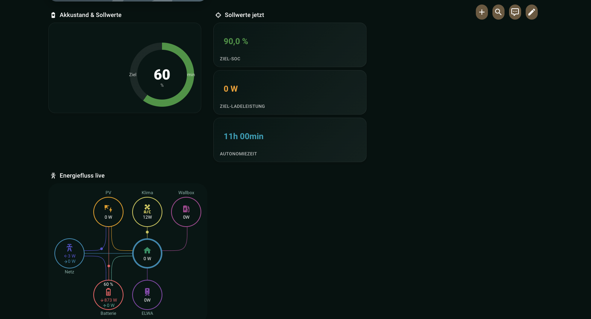

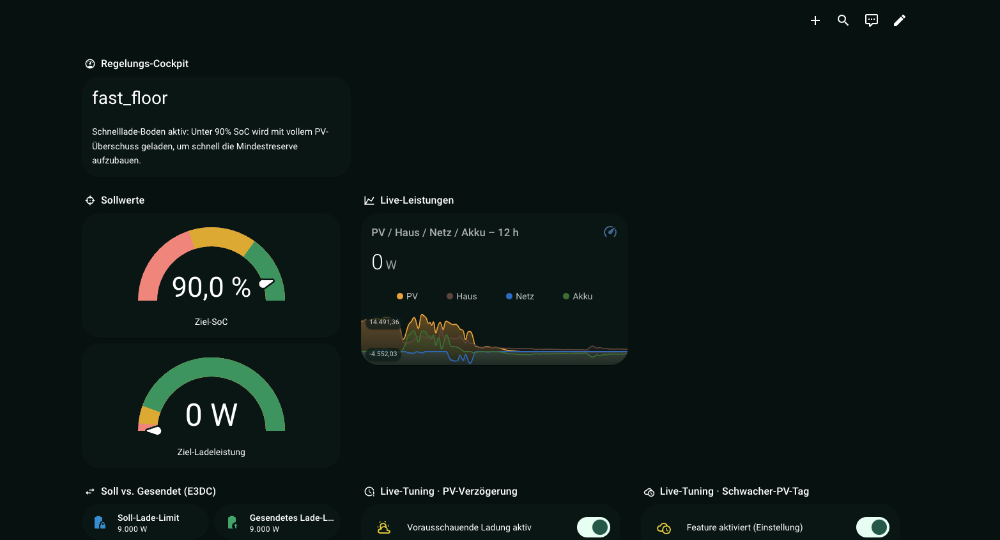

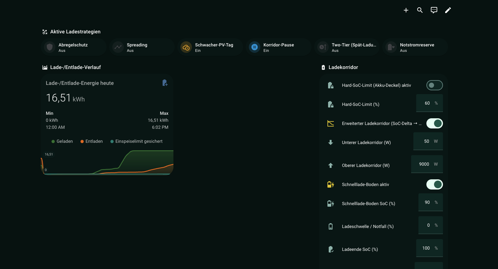

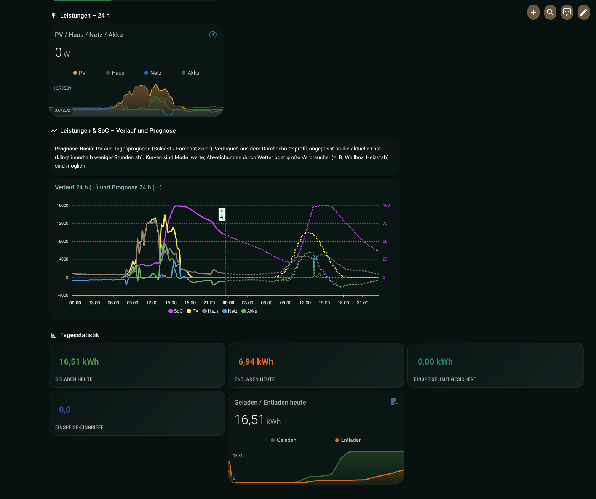

### Classic dashboard

One screenshot per main module.

#### Tab 1 – Dashboard & Live Overview
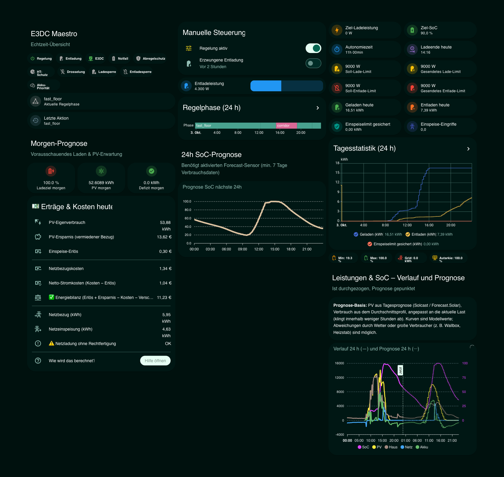

#### Tab 2 – Control Cockpit
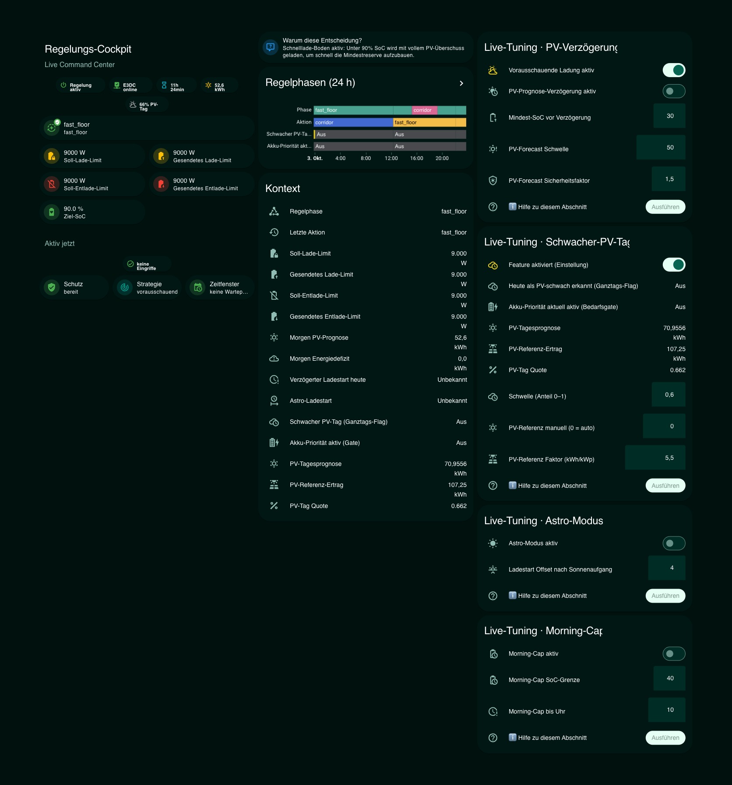

#### Tab 3 – Charging & Charge Strategy
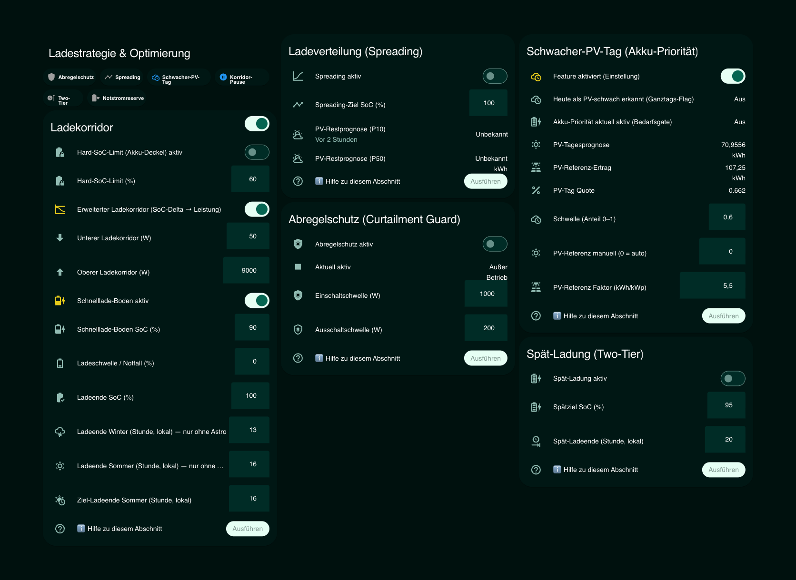

#### Tab 4 – Scheduling & Astro Mode
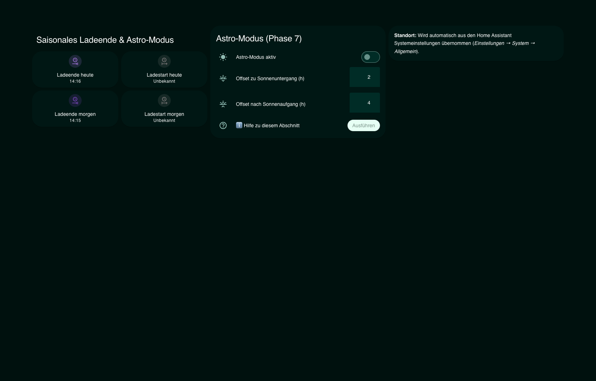

#### Tab 5 – Grid & Tariff
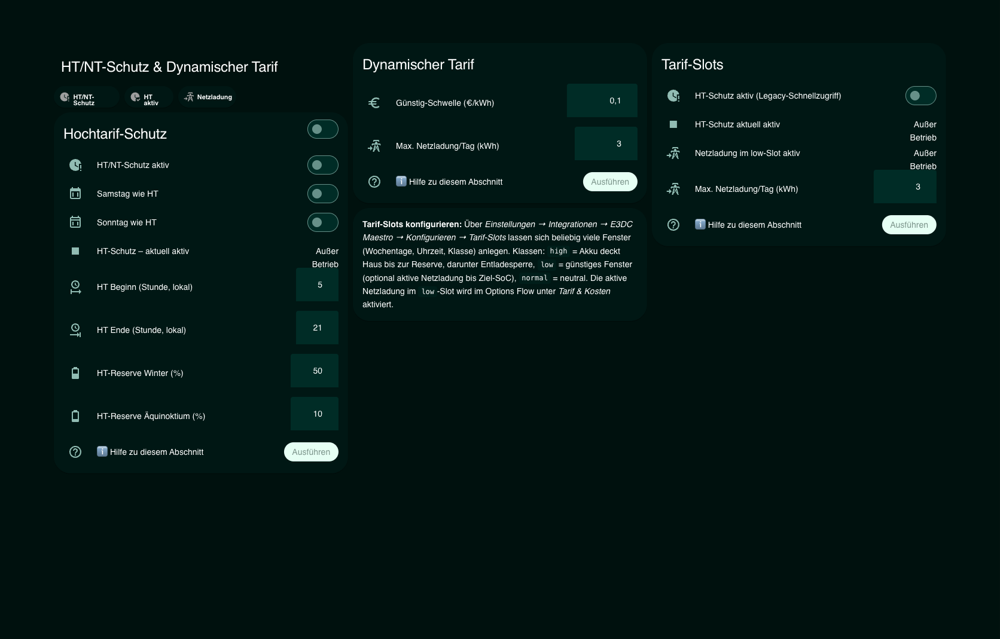

#### Tab 6 – Flexibility (Wallbox, Heat Pump, Pre-Discharge)
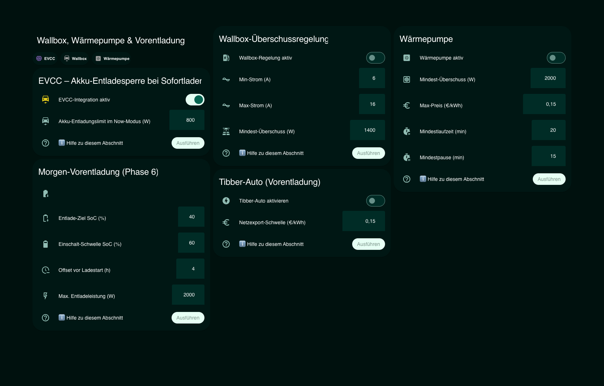

#### Tab 7 – Settings & System Parameters
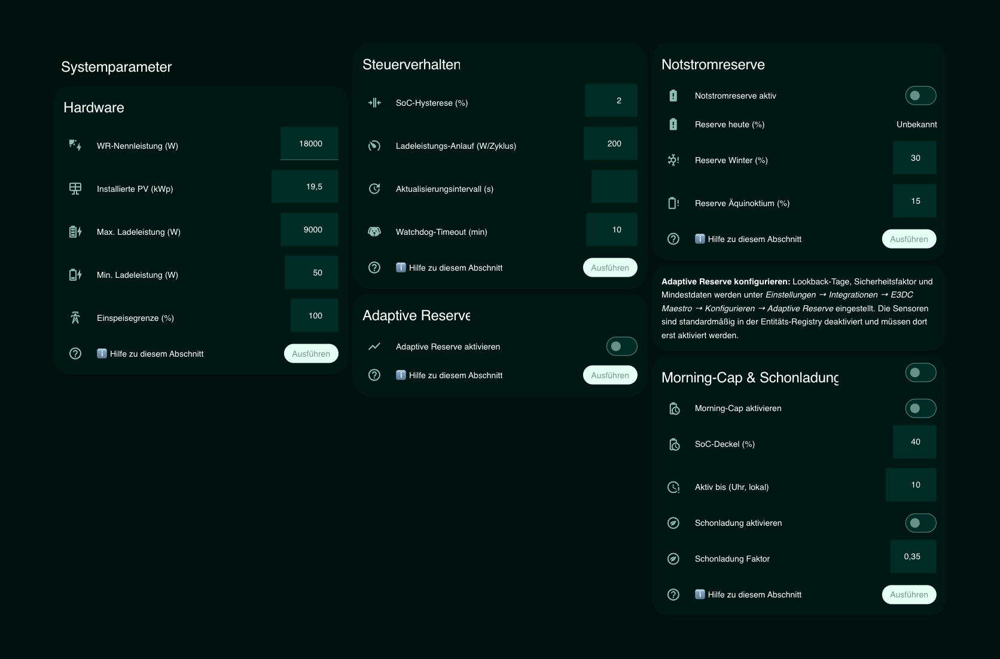

#### Tab 8 – Diagnostics & Debug
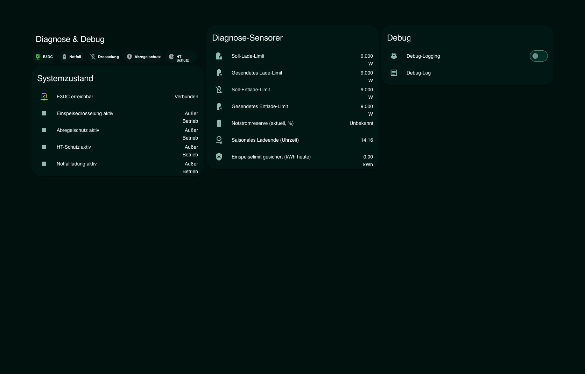

#### Tab 9 – Help & Glossary
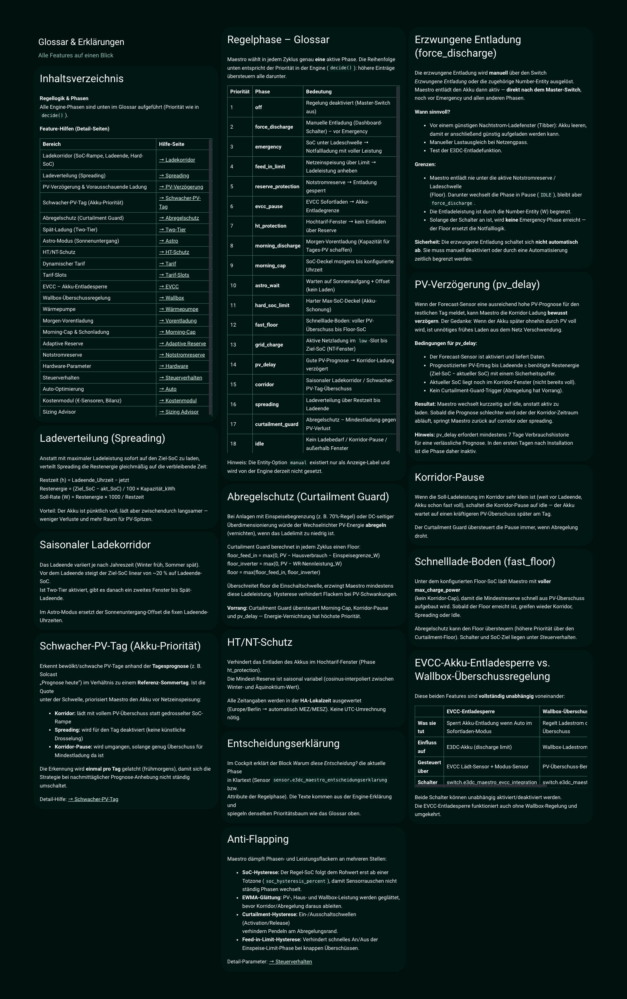

#### Tab 10 – Auto-Optimisation
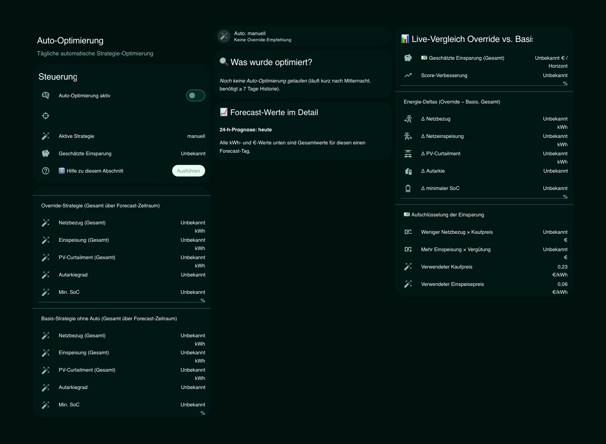

#### Tab 11 – Battery & PV Sizing Advisor
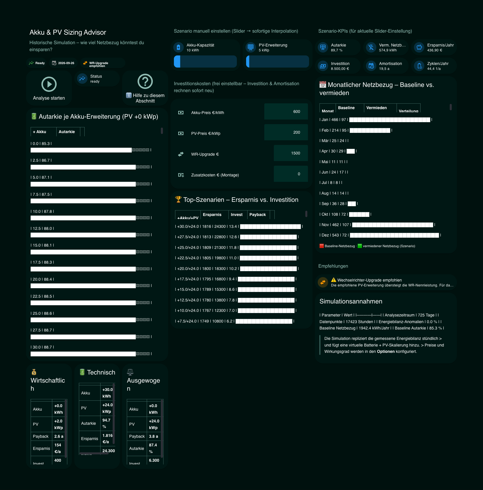

---

## Requirements

| Requirement | Details |
|---|---|
| **Home Assistant** | ≥ 2024.1.0 (recommended: ≥ 2024.11) |
| **HACS** | latest version |
| **[e3dc_rscp](https://github.com/torbennehmer/hacs-e3dc)** | must be installed, configured and active |
| **E3DC device** | All E3DC systems supported by `e3dc_rscp` (tested: S10E, S10E Pro) |
| **Solcast / Forecast.Solar** | optional but recommended for PV forecast features (forward-looking charge, PV delay) |

> **Important:** E3DC Maestro reads sensors from `e3dc_rscp` and calls its services (`set_power_limits`, `set_power_mode`, `manual_charge`). Without a working and correctly configured `e3dc_rscp` integration, Maestro **cannot control** the battery.

> **⚠️ AI360 must be disabled:** E3DC's built-in **AI360** function must be disabled in the E3DC device settings. AI360 overrides external charge commands and ignores Maestro's rules — both systems cannot run simultaneously. The setting is in the E3DC web interface or E3DC app under *Settings → Energy Management → AI360*.

---

## Dependency: configure e3dc_rscp

Before setting up E3DC Maestro, `e3dc_rscp` must be **correctly configured**. Incorrect sensor signs are the most common cause of misbehaviour.

### 1. Verify sign conventions

Maestro expects the following sign convention:

| Sensor | Positive | Negative |
|---|---|---|
| `grid_power_sensor` | Export to grid | Import from grid |
| `battery_power_sensor` | Battery charging | Battery discharging |
| `pv_power_sensor` | always ≥ 0 | – |
| `house_power_sensor` | always ≥ 0 | – |

**How to check:** Open *Developer Tools → States* in HA and observe values while PV is producing:
- PV sensor: must be positive (~4000 W at noon)
- Grid sensor: positive when exporting, negative when importing
- Battery sensor: positive while charging, negative while discharging

**If signs are inverted**, create a template sensor (e.g. in `configuration.yaml`):

```yaml
template:
  - sensor:
      - name: "E3DC Grid corrected"
        unit_of_measurement: "W"
        device_class: power
        state_class: measurement
        state: "{{ -(states('sensor.your_grid_sensor') | float(0)) }}"
```

Restart HA after changes.

---

## Installation via HACS

### Step 1: Add repository

1. Open **HACS** → Integrations → three-dot menu (top right) → **Custom repositories**
2. Enter URL: `https://github.com/TommiG1/hacs-e3dc-maestro`
3. Category: **Integration** → **Add**

### Step 2: Download integration

1. Search for **E3DC Maestro** in the HACS integration list
2. Click **Download** → confirm version

### Step 3: Restart Home Assistant

Settings → System → **Restart** (full restart, not just reload)

### Step 4: Set up integration

1. **Settings → Devices & Services → Add Integration**
2. Search for **E3DC Maestro**
3. Follow the setup wizard (see next section)

> **Note:** If E3DC Maestro doesn't appear in the search, clear the browser cache (Ctrl+Shift+R) and try again.

---

## Setup (Config Flow)

The setup wizard has **11 steps**. All parameters can be changed at any time under **Settings → Devices & Services → E3DC Maestro → Configure** — no restart required.

> **Since v0.3.7:** the Configure dialog opens with a **central navigation menu**.
> You can jump directly to any section (sources, system, season, tariff, wallbox,
> heat pump, sizing advisor, …) instead of clicking through all steps in order.
> After editing a section you return to the menu and can either edit another
> section or close the dialog via **Save & Close**.

---

### Step 1: Source entities

Maps Maestro to the sensor entities from `e3dc_rscp` (or Modbus).

> **✨ Auto-detection:** If `e3dc_rscp` is installed, Maestro pre-fills all sensors
> (SoC, PV, house, grid, battery, wallbox consumption) and inverts the grid sign for
> `_transfer_to_from_grid` automatically. An **openWB** wallbox is detected via
> `sensor.openwb_chargepoint*_ladeleistung`, and an existing **EVCC integration**
> ([marq24/ha-evcc](https://github.com/marq24/ha-evcc), domain `evcc_intg`) is detected
> as well. All suggestions can be overridden.

| Field | Required | Typical Entity ID | Convention |
|---|---|---|---|
| **State of Charge (SoC)** | ✓ | `sensor.<devicename>_battery_rsoc` | 0–100 % |
| **PV power** | ✓ | `sensor.<devicename>_solar_power` | W, ≥ 0 |
| **Additional generation** | – | – | W, ≥ 0, added to PV (e.g. second inverter) |
| **House power** | ✓ | `sensor.<devicename>_home_power` | W, ≥ 0 |
| **Grid power** | ✓ | `sensor.<devicename>_grid_power` | W, **positive = export** |
| **Battery power** | ✓ | `sensor.<devicename>_battery_power` | W, **positive = charging, negative = discharging** |
| **Charged today (kWh)** | – | `sensor.<devicename>_battery_charge_today` | kWh (RSCP daily value, more accurate than Riemann sum) |
| **Discharged today (kWh)** | – | `sensor.<devicename>_battery_discharge_today` | kWh (RSCP daily value) |

> **Tip:** `<devicename>` is the name you gave when setting up `e3dc_rscp`. Find exact entity IDs under *Developer Tools → States* — search for `battery_rsoc`, `solar_power`, `grid_power`.

---

### Step 2: System parameters

Describes your system hardware.

| Parameter | Default | Description |
|---|---|---|
| **Inverter rated power (W)** | 12 000 | Maximum AC output power of the inverter |
| **Installed PV capacity (kWp)** | 10.0 | Used for feed-in limit and forecast calculations |
| **Max. charge power (W)** | 3 000 | Upper limit for battery charge commands |
| **Min. charge power (W)** | 300 | Lower limit; below this no charging command is sent |
| **Feed-in limit (%)** | 70 | % of installed kWp — `feed_in_limit` phase triggers above this |
| **Update interval (s)** | 30 | How often Maestro decides; shorter intervals increase DB load |
| **Advanced corridor** | off | If on: charge power directly in W instead of power factor |
| **Lower corridor (W)** | 500 | Minimum charge power in advanced corridor mode |
| **Upper corridor (W)** | 1 500 | Maximum charge power in advanced corridor mode |
| **Charge ramp (W/cycle)** | 500 | Ramp: charge power increases by at most this value per cycle |

---

### Step 3: Season & charge corridor

Defines when and to what SoC target the battery is charged each day.

| Parameter | Default | Description |
|---|---|---|
| **Charge threshold (%)** | 15 | SoC floor for emergency charging (`emergency` phase) |
| **Charge target SoC (%)** | 85 | Daily target SoC for the seasonal corridor |
| **Winter minimum charge end (h)** | 11:00 | Earliest charge end in winter (local time) |
| **Summer maximum charge end (h)** | 14:00 | Latest charge end in summer (local time) |
| **Summer charge end target (h)** | 18:30 | Battery should be fully charged by this time in summer |

Maestro calculates the optimal charge window **daily** (based on the current date) by interpolating between the summer and winter values.

---

### Step 4: Peak-tariff (HT) protection

During expensive peak-tariff hours the battery keeps covering the house load and is only stopped once it reaches the reserve floor — protecting enough capacity for the rest of the window instead of buying expensive grid power. The `Reserve winter/equinox` values below are that floor (the battery is not discharged **below** them).

| Parameter | Default | Description |
|---|---|---|
| **HT protection enabled** | off | Enables all HT logic |
| **Peak tariff start (h)** | 5 | Local time (CET/CEST automatically) |
| **Peak tariff end (h)** | 21 | Local time |
| **Reserve winter (%)** | 50 | Minimum SoC kept during HT window (winter) |
| **Reserve equinox (%)** | 10 | Minimum SoC at equinox |
| **HT on Saturdays** | off | HT protection also applies on Saturdays |
| **HT on Sundays** | off | HT protection also applies on Sundays |

---

### Step 5: PV forecast / charge delay

Delays the corridor charge start if today's remaining PV forecast is sufficient to fill the battery later.

| Parameter | Default | Description |
|---|---|---|
| **PV forecast delay** | off | Enables `pv_delay` phase |
| **Forecast sensor** | – | Entity ID of a sensor providing remaining PV kWh today |
| **Min. forecast (kWh)** | 5.0 | Absolute threshold: only delay if forecast ≥ this value |
| **Usable battery capacity (kWh)** | 10.0 | How many kWh the battery still needs to reach target SoC |
| **Safety factor** | 1.2 | Forecast must be ≥ required × factor |
| **Tomorrow PV sensor** | – | For forward-looking charging: tomorrow's PV forecast (kWh) |
| **Tomorrow consumption sensor** | – | For forward-looking charging: estimated consumption tomorrow (kWh) |

**Recommended forecast integrations (HACS):**
- [Solcast PV Forecast](https://github.com/BJReplay/ha-solcast-solar): `sensor.solcast_pv_forecast_forecast_today_remaining` / `sensor.solcast_pv_forecast_forecast_tomorrow`
- [Forecast.Solar](https://www.home-assistant.io/integrations/forecast_solar/): `sensor.energy_production_today_remaining`

---

### Step 6: Dynamic tariffs & tariff slots

Charges the battery from the grid when the spot electricity price is cheap.

| Parameter | Default | Description |
|---|---|---|
| **Dynamic tariffs** | off | Enables cheap grid charging |
| **Price sensor (€/kWh)** | – | e.g. Tibber or aWATTar price sensor |
| **Cheap threshold (€/kWh)** | 0.10 | Below this price, grid charging is triggered |
| **Max. grid charge/day (kWh)** | 3.0 | Daily cap for grid-charged energy |
| **Active grid charge in low slot** | off | In a `low` slot, actively charges from the grid up to the target SoC — **regardless of tariff mode** (phase `grid_charge`). For classic off-peak (NT) windows |
| **Grid charge target in low slot (% SoC)** | 60 | Target SoC charged from the grid inside a `low` slot. Capped by Max. grid charge/day. Acts as upper bound when forecast-based |
| **Forecast-based grid charge amount** | off | Instead of a fixed target SoC, charges only as much as tomorrow's PV/consumption forecast requires (deficit = consumption − PV). Uses the *tomorrow PV* + *tomorrow consumption* sensors; falls back to the fixed target when no data |

> **Passive vs. active `low` slot:** Without this option the `low` class is
> purely passive — it only lifts the PV-surplus ceiling, and only when
> `tariff_mode=dynamic`. For a classic peak/off-peak contract (fixed tariff),
> enable **Active grid charge in low slot** so the off-peak window is actually
> used to recharge.

---

### Step 7: Wallbox

Controls wallbox charge current based on PV surplus **and/or** cleanly separates the
wallbox consumption from the house load.

#### House / wallbox load split (since v0.3.1)

If you configure a **wallbox power sensor**, Maestro separates the EV charge load from
the house load. EWMA smoothing, PV forecast and the optimizer are then **no longer
distorted by EV charge spikes**. The split is independent of the “Wallbox control”
switch — you can wire up the sensor purely for clean statistics.

| Parameter | Default | Description |
|---|---|---|
| **Wallbox control** | off | Enables current-limiting logic |
| **Wallbox type** | e3dc | `e3dc` = native E3DC wallbox (RSCP service); `generic` = openWB / EVCC / any wallbox via custom services |
| **Wallbox power sensor** | – | Wattage sensor of the wallbox (e.g. `sensor.<device>_wallbox_consumption` or `sensor.openwb_chargepoint_4_ladeleistung`). Auto-detected. |
| **House meter already includes wallbox** | auto | `false` for native E3DC wallbox (separate power meter); `true` for openWB on the grid meter. If on, Maestro subtracts the wallbox value from the house power. |
| **Min. current (A)** | 6 | IEC-61851 minimum |
| **Max. current (A)** | 16 | Maximum allowed charge current |
| **Phases** | 3 | 1 or 3 phases |
| **Min. PV surplus (W)** | 1 400 | Wallbox activates only above this surplus |

**New sensors:** `sensor.e3dc_maestro_wallbox_leistung` (W), `sensor.e3dc_maestro_gesamtlast_haus_wallbox` (W = house + wallbox), `sensor.e3dc_maestro_wallbox_energie_heute` (kWh, Energy-Dashboard compatible).

---

### Step 7b: EVCC integration (OpenWB, evcc.io)

Maestro can monitor an EVCC-compatible wallbox and react accordingly.

| Parameter | Default | Description |
|---|---|---|
| **EVCC integration** | off | |
| **EVCC charging sensor** | – | Sensor or binary sensor showing whether the car is actively charging |
| **EVCC mode sensor** | – | Sensor reporting the active charging mode |
| **Now-mode value** | `now` | Which mode-sensor value counts as "instant charge" (evcc.io: `now`; OpenWB: `Instant Charging`) |
| **Discharge limit in Now mode** | `0` W | Max battery discharge power while EVCC charges in Now mode. `0` = fully block discharge. |

---

### Step 8: Heat pump

Switches the heat pump on when PV surplus is available.

| Parameter | Default | Description |
|---|---|---|
| **HP control** | off | |
| **HP switch entity** | – | `switch.xxx` or `input_boolean.xxx` |
| **Min. PV surplus (W)** | 2 000 | Switch-on threshold |
| **Max. electricity price (€/kWh)** | 0.15 | No switch-on above this price |
| **HP min. run time (min)** | 20 | HP stays on for at least this long |
| **HP min. pause time (min)** | 15 | HP stays off for at least this long |

---

### Step 9: Failsafe & watchdog

| Parameter | Default | Description |
|---|---|---|
| **Watchdog timeout (min)** | 10 | After this many minutes with sensor errors, Maestro sends a persistent HA notification. `0` = disabled. |

---

### Step 10: F0 / Gentle-Charge & F3 Auto-Mode

Fine-tuning of the gentle-charge ramp and the auto-optimiser objective. Defaults
are sensible — advanced tuning only.

---

### Step 11: Battery & PV Sizing Advisor (v0.3.7)

The Sizing Advisor runs a **2D historical simulation** (additional battery
× additional PV) on hourly energy data from the **HA Energy Dashboard** (Recorder
long-term statistics, `statistics_during_period`). It calculates savings, payback
time, self-sufficiency and three recommendations.

> **✨ Auto-detection:** all energy sensors (PV, house, grid import/export,
> battery charge/discharge, optional wallbox + heat pump) are pre-filled from the
> HA Energy Dashboard. The PV slot accepts **multiple sensors** (multi-inverter
> setups). RSCP sensors are used as fallback.

| Parameter | Default | Range | Description |
|---|---:|:---:|---|
| Analysis period | 365 days | 30–730 | How many days of history to analyse |
| Electricity price | 0.30 €/kWh | 0.05–2.00 | For savings calculation |
| Feed-in tariff | 0.08 €/kWh | 0.00–1.00 | FiT revenue for avoided grid export |
| Battery price | 600 €/kWh | 100–5 000 | Battery investment cost |
| PV price | 1 200 €/kWp | 200–5 000 | PV expansion investment cost |
| Inverter upgrade flat | 1 500 € | 0–20 000 | One-off cost for inverter replacement |
| Round-trip efficiency | 92 % | 50–100 % | Battery charge/discharge round-trip |
| Max. battery sweep | 30 kWh | 5–200 | Upper bound for battery sweep |
| Battery step size | 2.5 kWh | 0.5–10 | Resolution along the battery axis |
| Max. PV sweep | 20 kWp | 0–200 | Upper bound for PV sweep |
| PV step size | 2.0 kWp | 0.5–10 | Resolution along the PV axis |

The analysis is started via **Sizing Advisor → Start analysis** in the dashboard
(button entity `button.e3dc_maestro_sizing_analyse_starten`). It runs in a thread
pool (does not block the HA event loop). The result is persisted via `Store` and
survives HA restarts.

> **Scenario sliders:** the scenario explorer (sliders for additional battery /
> PV) interpolates bilinearly inside the sweep matrix, so live updates are
> CPU-free. The cost inputs (battery price, PV price, inverter upgrade, extra)
> recalculate investment and payback **instantly** without re-running the
> simulation.

### Finish: Add the dashboard

After the Sizing Advisor, the setup flow shows an **“Add dashboard”** page.
When you finish, Home Assistant also creates a persistent notification with
the same instructions:

1. **Hard-reload** the browser (Cmd/Ctrl+Shift+R)
2. **Settings → Dashboards → Add dashboard**
3. Under **Community dashboards**, choose **E3DC Maestro**
4. Keep the suggested title **E3DC Maestro** → Create

Requirements: **Home Assistant ≥ 2026.5**, plus Mushroom Cards and ApexCharts
Card from HACS. The URL path must be `e3dc-maestro` so help links work. Older
HA versions can use the manual YAML import as a fallback.

---

## Provided Entities

All entities appear under the device **E3DC Maestro** in *Settings → Devices & Services → E3DC Maestro → Show device*.

---

### Sensors – Standard (enabled)

| Entity ID | Name | Unit | Description |
|---|---|---|---|
| `sensor.e3dc_maestro_regelphase` | Control phase | – | Current active phase (enum, see rule logic) |
| `sensor.e3dc_maestro_ziel_ladeleistung` | Target charge power | W | Calculated target charge power (0 when inactive) |
| `sensor.e3dc_maestro_ziel_soc` | Target SoC | % | Current daily charge target |
| `sensor.e3dc_maestro_letzte_aktion` | Last action | – | Phase + reason + parameters of the last control action (as attributes) |
| `sensor.e3dc_maestro_entscheidungserklarung` | Decision explanation | – | Plain-language “why this decision?” for the current phase |
| `sensor.e3dc_maestro_geladen_heute` | Charged today | kWh | Energy charged today |
| `sensor.e3dc_maestro_entladen_heute` | Discharged today | kWh | Energy discharged today |
| `sensor.e3dc_maestro_einspeise_eingriffe_heute` | Feed-in interventions today | – | Number of interventions due to feed-in limit |
| `sensor.e3dc_maestro_pv_verlust_verhindert_heute` | PV loss prevented today | kWh | Sum of prevented curtailment + feed-in limit interventions |
| `sensor.e3dc_maestro_autonomiezeit` | Autonomy time | – | Estimated battery range as "Xh YYmin" |
| `sensor.e3dc_maestro_vorausschauendes_ladeziel` | Forward-looking charge target | % | Dynamic charge target based on tomorrow's PV forecast |
| `sensor.e3dc_maestro_morgen_pv_prognose` | Tomorrow PV forecast | kWh | Solcast forecast for tomorrow |
| `sensor.e3dc_maestro_morgen_energiedefizit` | Tomorrow energy deficit | kWh | max(0, consumption − PV) tomorrow |
| `sensor.e3dc_maestro_saisonales_ladeende_uhrzeit` | Seasonal charge end | – | Calculated charge end target today (HH:MM) |
| `sensor.e3dc_maestro_astro_ladestart_uhrzeit` | Astro charge start | – | Calculated charge start after sunrise (HH:MM) |
| `sensor.e3dc_maestro_forecast_min_soc_nachste_24h` | Forecast: Min SoC next 24h | % | Simulated minimum SoC in the next 24 h |
| `sensor.e3dc_maestro_forecast_max_soc_nachste_24h` | Forecast: Max SoC next 24h | % | Simulated maximum SoC |
| `sensor.e3dc_maestro_forecast_netzbezug_nachste_24h` | Forecast: Grid draw next 24h | kWh | Simulated grid import |
| `sensor.e3dc_maestro_forecast_autarkie_nachste_24h` | Forecast: Self-sufficiency next 24h | % | Simulated self-sufficiency rate |
| `sensor.e3dc_maestro_forecast_soc_trajektorie_24h` | Forecast: SoC trajectory 24h | % | ApexCharts sensor with SoC and power points (`trajectory_points`, `pv_points`, `house_points`, `grid_points`, `battery_points`) |
| `sensor.e3dc_maestro_forecast_datenqualitat` | Forecast: Data quality | – | Shows whether consumption and PV profiles have sufficient data |
| `sensor.e3dc_maestro_auto_aktive_strategie` | Auto: Active strategy | – | Shows whether auto-optimisation is active and which objective was chosen |
| `sensor.e3dc_maestro_auto_geschatzte_einsparung` | Auto: Estimated savings | % | Simulated improvement vs. baseline |
| `sensor.e3dc_maestro_soll_lade_limit` | Target charge limit | W | Currently set charge limit (e.g. 0 W when blocked, 3000 W during curtailment guard); `unknown` if no limit active |
| `sensor.e3dc_maestro_soll_entlade_limit` | Target discharge limit | W | Currently set discharge limit (e.g. 0 W during EVCC pause); `unknown` if no limit active |

#### Sizing Advisor sensors (v0.3.7)

Static analysis results (filled after pressing **Start analysis**):

| Entity ID | Name | Unit | Description |
|---|---|---|---|
| `sensor.e3dc_maestro_advisor_status` | Advisor status | – | `idle` / `running` / `ready` |
| `sensor.e3dc_maestro_advisor_netzbezug_baseline_jahr` | Baseline grid import | kWh | Historic actual grid import (baseline scenario) |
| `sensor.e3dc_maestro_advisor_wirtschaftl_empfehlung_amortisation` | Recommendation – economic | – | Combination with min. payback time (attributes: full breakdown) |
| `sensor.e3dc_maestro_advisor_techn_empfehlung_autarkie` | Recommendation – technical | – | Combination with max. self-sufficiency |
| `sensor.e3dc_maestro_advisor_energiebilanz_anomalierate` | Anomaly rate | % | Share of hours with energy-balance anomalies (>5 % house load) |

Scenario sensors (live, follow the two sliders):

| Entity ID | Name | Unit | Description |
|---|---|---|---|
| `sensor.e3dc_maestro_advisor_autarkie_szenario` | Scenario self-sufficiency | % | For the current slider values |
| `sensor.e3dc_maestro_advisor_vermiedener_netzbezug_jahr` | Avoided grid import (scenario) | kWh | Per year |
| `sensor.e3dc_maestro_advisor_ersparnis_jahr` | Annual savings (scenario) | EUR | Per year |
| `sensor.e3dc_maestro_advisor_investition` | Investment (scenario) | EUR | Live from price entities |
| `sensor.e3dc_maestro_advisor_amortisationszeit` | Payback time (scenario) | years | Live from price entities |
| `sensor.e3dc_maestro_advisor_zyklen_jahr_virt_akku` | Cycles per year (scenario) | – | Battery wear indicator |

---

### Sensors – Diagnostic (enable manually)

These sensors are **disabled** by default (shown greyed out in the entity list). Enable them manually if needed.

| Entity ID | Name | Description |
|---|---|---|
| `sensor.e3dc_maestro_abregelung_verhindert_heute` | Curtailment prevented today | Energy secured by feed-in limit intervention (detail value of `pv_verlust_verhindert`) |
| `sensor.e3dc_maestro_dc_abregelung_verhindert_heute` | DC curtailment prevented today | Energy secured by curtailment guard (detail value) |
| `sensor.e3dc_maestro_notstromreserve_aktuell` | Emergency reserve (current) | Currently calculated reserve SoC (seasonally interpolated) |
| `sensor.e3dc_maestro_notstromreserve_adaptiv` | Emergency reserve (adaptive) | Consumption-adaptive calculated reserve |
| `sensor.e3dc_maestro_ht_reserve_adaptiv` | HT reserve (adaptive) | Adaptively calculated HT reserve |
| `sensor.e3dc_maestro_debug_log` | Debug log | Last 5 rule log entries; only useful with debug logging enabled |

---

### How to enable disabled entities

1. **Settings → Devices & Services → E3DC Maestro → Show device**
2. Scroll to the entity list, click **"Show disabled entities"** (link at the bottom)
3. Click the desired entity
4. In the dialog: **"Enable entity"** → Confirm
5. The entity will show values after the next update cycle (~30 s)

Alternatively via *Settings → Entities*: filter by "E3DC Maestro" + tick "Show only disabled".

---

### Binary Sensors

| Entity ID | Name | Meaning |
|---|---|---|
| `binary_sensor.e3dc_maestro_e3dc_erreichbar` | E3DC reachable | E3DC responds to RSCP requests |
| `binary_sensor.e3dc_maestro_einspeisedrosselung_aktiv` | Feed-in throttling active | `feed_in_limit` phase active |
| `binary_sensor.e3dc_maestro_ht_schutz_aktiv` | HT protection active | `ht_protection` phase active |
| `binary_sensor.e3dc_maestro_notfallladung_aktiv` | Emergency charging active | `emergency` phase active |
| `binary_sensor.e3dc_maestro_abregelschutz_aktiv` | Curtailment guard active | `curtailment_guard` phase active |
| `binary_sensor.e3dc_maestro_netzladung_aktiv` | Grid charge active | `grid_charge` phase active |
| `binary_sensor.e3dc_maestro_schwacher_pv_tag` | Low-yield day | Today classified as a weak PV day (all-day flag) |
| `binary_sensor.e3dc_maestro_akku_prioritat_aktiv` | Battery priority active | Remaining-need gate is currently forcing battery-first charging |
| `binary_sensor.e3dc_maestro_ladesperre_aktiv` | Charge block active | `on` when Maestro has set a charge limit ≤ 0 W |
| `binary_sensor.e3dc_maestro_entladesperre_aktiv` | Discharge block active | `on` when Maestro has set a discharge limit ≤ 0 W (e.g. during EVCC pause) |
| `binary_sensor.e3dc_maestro_advisor_wr_upgrade_empfohlen` | Inverter upgrade recommended (Advisor) | `on` when the current slider scenario **or** the economic recommendation requires an inverter upgrade |

---

### Switches

| Entity ID | Name | Description |
|---|---|---|
| `switch.e3dc_maestro_regelung_aktiv` | Control active | **Master switch** — disables all control interventions |
| `switch.e3dc_maestro_erzwungene_entladung` | Forced discharge | Forces battery discharge, e.g. to free up capacity before a Tibber low-price window |
| `switch.e3dc_maestro_ht_nt_schutz` | HT/NT protection | Peak-tariff protection on/off |
| `switch.e3dc_maestro_ht_samstag` | HT Saturday | HT protection also on Saturdays |
| `switch.e3dc_maestro_ht_sonntag` | HT Sunday | HT protection also on Sundays |
| `switch.e3dc_maestro_wallbox_regelung` | Wallbox control | Wallbox control on/off |
| `switch.e3dc_maestro_wallbox_entladeschutz` | Wallbox discharge guard | Keep battery discharge open while the EV is charging |
| `switch.e3dc_maestro_warmepumpen_regelung` | Heat pump control | HP control on/off |
| `switch.e3dc_maestro_debug_logging` | Debug logging | Enables verbose log entries in the debug sensor |
| `switch.e3dc_maestro_saisonale_notstromreserve` | Seasonal emergency reserve | Seasonally interpolated reserve on/off |
| `switch.e3dc_maestro_adaptive_reserve_verbrauchsmittel` | Adaptive reserve | Consumption-adaptive reserve on/off |
| `switch.e3dc_maestro_evcc_integration` | EVCC integration | Enables EVCC/OpenWB coupling |
| `switch.e3dc_maestro_abregelschutz` | Curtailment guard | Curtailment guard on/off |
| `switch.e3dc_maestro_korridor_pause_min_ladeleistung` | Corridor pause | Pauses charging when power would fall below the minimum |
| `switch.e3dc_maestro_spat_ladung_two_tier` | Late charging (two-tier) | Second charge target in the evening |
| `switch.e3dc_maestro_vorentladung_tibber_auto` | Pre-discharge Tibber auto | Automatic pre-discharge based on Tibber price |
| `switch.e3dc_maestro_ladeverteilung_spreading` | Charge spreading | Spread PV surplus evenly (default ON since v0.3.1) |
| `switch.e3dc_maestro_astro_modus_sonnenuberwachung` | Astro mode | Link charge end/start to sun position |
| `switch.e3dc_maestro_morning_cap_soc_deckel_morgens` | Morning cap | Morning SoC ceiling active |
| `switch.e3dc_maestro_schonladung_reduzierte_ladeleistung` | Gentle charging | Reduced charge power for battery health |
| `switch.e3dc_maestro_auto_optimierung` | Auto-optimisation | Grid-search optimiser on/off |
| `switch.e3dc_maestro_hard_soc_limit_akku_deckel` | Hard SoC limit | Fixed charge ceiling on/off |
| `switch.e3dc_maestro_vorausschauende_ladung` | Forward-looking charging | Raises today's charge target if tomorrow's PV is expected to be low |
| `switch.e3dc_maestro_schwacher_pv_tag_prioritat` | Low-yield-day priority | Battery-first charging on weak PV days |
| `switch.e3dc_maestro_schnelllade_boden` | Fast-charge floor | Full PV surplus until the floor SoC |

---

### Numbers

All Config Flow parameters are also available as Number entities and can be **changed live** (immediately persisted, no restart required).

| Entity ID | Name | Unit |
|---|---|---|
| `number.e3dc_maestro_wr_leistung` | Inverter power | W |
| `number.e3dc_maestro_max_ladeleistung` | Max. charge power | W |
| `number.e3dc_maestro_min_ladeleistung` | Min. charge power | W |
| `number.e3dc_maestro_installierte_pv_leistung` | Installed PV capacity | kWp |
| `number.e3dc_maestro_einspeisegrenze` | Feed-in limit | % |
| `number.e3dc_maestro_ladeschwelle` | Charge threshold | % |
| `number.e3dc_maestro_ladeende_soc` | Charge target SoC | % |
| `number.e3dc_maestro_ladeende_winter` | Charge end winter | h |
| `number.e3dc_maestro_ladeende_sommer` | Charge end summer | h |
| `number.e3dc_maestro_sommerladeende_ziel` | Summer charge end target | h |
| `number.e3dc_maestro_spreading_ziel_soc` | Spreading target SoC | % |
| `number.e3dc_maestro_unterer_ladekorridor` | Lower charge corridor | W |
| `number.e3dc_maestro_oberer_ladekorridor` | Upper charge corridor | W |
| `number.e3dc_maestro_ht_beginn` | HT start | h |
| `number.e3dc_maestro_ht_ende` | HT end | h |
| `number.e3dc_maestro_ht_reserve_winter` | HT reserve winter | % |
| `number.e3dc_maestro_ht_sockel_aquinoktium` | HT reserve equinox | % |
| `number.e3dc_maestro_gunstig_schwelle` | Cheap threshold | €/kWh |
| `number.e3dc_maestro_max_netzladung_tag` | Max. grid charge/day | kWh |
| `number.e3dc_maestro_wallbox_min_strom` | Wallbox min. current | A |
| `number.e3dc_maestro_wallbox_max_strom` | Wallbox max. current | A |
| `number.e3dc_maestro_wallbox_mindest_uberschuss` | Wallbox min. surplus | W |
| `number.e3dc_maestro_wp_mindest_uberschuss` | HP min. surplus | W |
| `number.e3dc_maestro_wp_max_preis` | HP max. price | €/kWh |
| `number.e3dc_maestro_wp_mindestlaufzeit` | HP min. run time | min |
| `number.e3dc_maestro_wp_mindestpause` | HP min. pause time | min |
| `number.e3dc_maestro_watchdog_timeout` | Watchdog timeout | min |
| `number.e3dc_maestro_ladeleistungs_anlauf` | Charge ramp | W/cycle |
| `number.e3dc_maestro_notstromreserve_winter` | Emergency reserve winter | % |
| `number.e3dc_maestro_notstromreserve_aquinoktium` | Emergency reserve equinox | % |
| `number.e3dc_maestro_abregelschutz_einschaltschwelle` | Curtailment guard activation threshold | W |
| `number.e3dc_maestro_abregelschutz_ausschaltschwelle` | Curtailment guard release threshold | W |
| `number.e3dc_maestro_spatziel_soc` | Late target SoC | % |
| `number.e3dc_maestro_spat_ladeende_stunde` | Late charge end hour | h |
| `number.e3dc_maestro_vorentladungs_ziel_soc` | Pre-discharge target SoC | % |
| `number.e3dc_maestro_vorentladungs_einschwelle_soc` | Pre-discharge activation SoC | % |
| `number.e3dc_maestro_vorentladungs_offset_stunden_vor_ladestart` | Pre-discharge offset | h |
| `number.e3dc_maestro_vorentladungs_max_leistung` | Pre-discharge max. power | W |
| `number.e3dc_maestro_erzwungene_entladungsleistung` | Forced discharge power | W |
| `number.e3dc_maestro_tibber_schwelle_fur_netzexport` | Tibber threshold for grid export | €/kWh |
| `number.e3dc_maestro_ladeende_offset_zu_sonnenuntergang` | Charge end offset to sunset | h |
| `number.e3dc_maestro_ladestart_offset_nach_sonnenaufgang` | Charge start offset after sunrise | h |
| `number.e3dc_maestro_morning_cap_soc_grenze` | Morning cap SoC ceiling | % |
| `number.e3dc_maestro_morning_cap_aktiv_bis_uhr_lokal` | Morning cap active until (hour) | h |
| `number.e3dc_maestro_schonladung_faktor` | Gentle charge factor | – |
| `number.e3dc_maestro_hard_soc_limit_akku_deckel` | Hard SoC limit | % |
| `number.e3dc_maestro_vorausschauende_ladung_max_soc` | Forward-looking charge max SoC | % |

#### Sizing Advisor numbers (v0.3.7)

| Entity ID | Name | Unit |
|---|---|---|
| `number.e3dc_maestro_advisor_hypothetische_batteriekapazitat` | Hypothetical additional battery | kWh |
| `number.e3dc_maestro_advisor_hypothetische_pv_erweiterung` | Hypothetical additional PV | kWp |
| `number.e3dc_maestro_advisor_preis_akku_eur_kwh` | Battery price | €/kWh |
| `number.e3dc_maestro_advisor_preis_pv_eur_kwp` | PV price | €/kWp |
| `number.e3dc_maestro_advisor_preis_wr_upgrade_eur` | Inverter upgrade price | € |
| `number.e3dc_maestro_advisor_zusatzkosten_eur_montage_nebenkosten` | Extra costs (installation, misc.) | € |

---

### Selects

| Entity ID | Name | Options |
|---|---|---|
| `select.e3dc_maestro_wallbox_typ` | Wallbox type | `e3dc`, `generic` |
| `select.e3dc_maestro_vorentladungs_modus` | Pre-discharge mode | `off`, `passive`, `active_house`, `active_grid` |
| `select.e3dc_maestro_auto_optimierung_ziel` | Auto-optimisation objective | `self_consumption`, `cost`, `co2` |

---

### Buttons

| Entity ID | Name | Action |
|---|---|---|
| `button.e3dc_maestro_limits_jetzt_freigeben` | Release limits now | Clears all active power limits (service `clear_power_limits`) |
| `button.e3dc_maestro_manuell_laden_3_kwh` | Manual charge (3 kWh) | Triggers an immediate 3 kWh charge (rate-limited: max. once every 2 h) |
| `button.e3dc_maestro_statistik_zurucksetzen` | Reset statistics | Resets all daily statistics (charged, discharged, PV loss) to 0 |
| `button.e3dc_maestro_sizing_analyse_starten` | Start sizing analysis (v0.3.7) | Triggers the 2D sweep simulation in a background thread pool |

---

## Rule Logic & Phase Priority

Maestro decides **every tick** (default: 30 s) in descending priority. The first matching phase wins.

| Priority | Phase | Trigger | Action |
|---|---|---|---|
| 1 | `off` | Master switch disabled | No interventions |
| 2 | `manual` | Manual charge running | Wait until complete |
| 3 | `emergency` | SoC < charge threshold | Max. charge power |
| 4 | `feed_in_limit` | Export > feed-in limit | Increase charge power |
| 5 | `reserve_protection` | SoC ≤ seasonal emergency reserve | Block discharge |
| 6 | `evcc_pause` | EVCC charging in Now mode | Pause Maestro control |
| 7 | `ht_protection` | HT window + SoC < HT reserve | Block discharge |
| 8 | `force_discharge` | "Forced discharge" switch | Actively discharge |
| 9 | `morning_discharge` | Pre-discharge conditions met | Discharge in morning |
| 10 | `astro_wait` | Before astro charge-start time | Not yet charging |
| 11 | `morning_cap` | SoC > morning cap and before cap hour | Block charging |
| 12 | `hard_soc_limit` | SoC ≥ hard SoC limit | Block charging (1 W sentinel) |
| 13 | `fast_floor` | SoC below fast-charge floor | Charge with full PV surplus |
| 14 | `grid_charge` | Active grid charge in a `low` slot | Charge from the grid up to the slot target |
| 15 | `corridor` | SoC < daily target | Seasonal charging |
| 16 | `pv_delay` | Corridor active but PV forecast sufficient | Wait for PV |
| 17 | `spreading` | Corridor active + spreading enabled (default ON) | Distribute charge power over time, smooth charge curve |
| 18 | `curtailment_guard` | Curtailment guard flag active | Hold minimum charge power |
| 19 | `idle` | No action needed | clear_power_limits (E3DC takes over) |

> **Note on `idle`:** In idle state Maestro sends `clear_power_limits`. The E3DC then autonomously routes PV surplus into the battery, even if the target SoC has already been reached. This is intentional.

---

## Set up Dashboard

The classic dashboard ([`dashboards/maestro_dashboard.yaml`](dashboards/maestro_dashboard.yaml))
provides **11 main tabs** (Dashboard, Cockpit, Charging, Scheduling, Grid & tariff,
Flexibility, System, Diagnostics, Help, Auto-optimisation, Sizing advisor) plus
topic-specific help views. With the community dashboard strategy you no longer
need to paste YAML by hand.

### Prerequisites

| Card | Installation |
|---|---|
| [Mushroom Cards](https://github.com/piitaya/lovelace-mushroom) | HACS → Frontend |
| [ApexCharts Card](https://github.com/RomRider/apexcharts-card) | HACS → Frontend |

Also: **Home Assistant ≥ 2026.5** for the *Community dashboards* picker entry
(older versions can still use the YAML fallback below).

### Recommended: Community dashboard (one click)

1. Set up the **E3DC Maestro** integration (or restart HA if it is already running)
2. **Hard-reload** the browser so the strategy module loads
3. **Settings → Dashboards → Add dashboard**
4. Under **Community dashboards**, choose **E3DC Maestro**
5. Keep the suggested title **E3DC Maestro** and icon → Create

> Help links require the URL path **`e3dc-maestro`**. The dialog suggests the
> matching title — do not rename before the slug is set.

The dashboard appears in the sidebar. Integration updates refresh the strategy
template; an already created storage dashboard stays as-is until you delete and
re-add it.

If you see **Timeout waiting for strategy element ll-strategy-dashboard-e3dc-maestro**,
restart Home Assistant and hard-reload the browser. Then check
**Settings → Dashboards → Resources** (Advanced Mode) for
`/e3dc_maestro/frontend/e3dc-maestro-strategy.js` as a JavaScript module.
YAML-mode Lovelace cannot auto-register that resource — add it yourself.

### Fallback: Manual YAML import

If the community picker is missing (older HA) or you prefer YAML:

1. **Settings → Dashboards → Add dashboard**
2. Title **E3DC Maestro** (slug `e3dc-maestro`)
3. Three-dot menu → **Edit in YAML**
4. Paste `maestro_dashboard.yaml` → Save

Or replace an existing dashboard via the raw configuration editor.

### Variant: Modern dashboard (manual)

[`dashboards/maestro_dashboard_modern.yaml`](dashboards/maestro_dashboard_modern.yaml)
is an optional modern look (live energy flow, graphs). It is **not** offered
automatically because five **installation-specific** raw E3DC entity IDs at the
top of the file must be adjusted first.

**Additional custom cards (HACS → Frontend):**

| Card | Installation |
|---|---|
| [button-card](https://github.com/custom-cards/button-card) | HACS → Frontend |
| [mini-graph-card](https://github.com/kalkih/mini-graph-card) | HACS → Frontend |
| [apexcharts-card](https://github.com/RomRider/apexcharts-card) | HACS → Frontend |
| [power-flow-card-plus](https://github.com/flixlix/power-flow-card-plus) | HACS → Frontend |

> Help links need slug **`e3dc-maestro-modern`** → title **E3DC Maestro Modern**.

**Before importing**, replace the placeholders
(`sensor.e3dc_pv_power`, `sensor.e3dc_house_power`,
`sensor.e3dc_grid_power`, `sensor.e3dc_battery_power`,
`sensor.e3dc_soc`) with your real E3DC sensors, then import YAML as in the
fallback.

---

## Sensor Sign Conventions

Maestro requires **consistent signs**. Wrong signs cause incorrect control behaviour.

| Sensor | Positive means | Negative means |
|---|---|---|
| `grid_power_sensor` | Export to grid | Import from grid |
| `battery_power_sensor` | Battery is charging | Battery is discharging |
| `pv_power_sensor` | Generation (always ≥ 0) | – |
| `house_power_sensor` | Consumption (always ≥ 0) | – |

If your sensors report inverted signs:

```yaml
# configuration.yaml
template:
  - sensor:
      - name: "E3DC Grid (sign corrected)"
        unit_of_measurement: "W"
        device_class: power
        state_class: measurement
        state: "{{ -(states('sensor.your_e3dc_grid_sensor') | float(0)) }}"
      - name: "E3DC Battery (sign corrected)"
        unit_of_measurement: "W"
        device_class: power
        state_class: measurement
        state: "{{ -(states('sensor.your_e3dc_battery_sensor') | float(0)) }}"
```

After creating the template sensors: restart HA and enter the new entity IDs in the Maestro config flow.

---

## Troubleshooting & FAQ

### Integration doesn't appear in the integration list after HACS download

Clear browser cache (Ctrl+Shift+R), then do a full HA restart (not just reload).

### "E3DC not reachable" / binary sensor red

1. Check that `e3dc_rscp` is working: *Settings → Devices & Services → e3dc_rscp*
2. Check that the E3DC is reachable on the network (ping / E3DC app)
3. Check the watchdog timeout value (default 10 min)

### Control phase is always `idle`, even though SoC is below target

Most common causes:
1. **Master switch off**: check `switch.e3dc_maestro_regelung_aktiv`
2. **Wrong sign** on grid or battery sensor (see above)
3. **Hard SoC limit** lower than current SoC: check `number.e3dc_maestro_hard_soc_limit_akku_deckel`

### Battery keeps charging despite `idle` phase

This is **correct**: in `idle` Maestro sends `clear_power_limits` to the E3DC, which then autonomously routes PV surplus into the battery. Maestro intentionally does not stop the battery in idle.

### PV loss prevented shows 0 kWh even though charging occurred

Only active if either `curtailment_guard` or `feed_in_limit` was triggered. Check:
- `switch.e3dc_maestro_abregelschutz` is enabled
- The curtailment guard activation threshold (`number.e3dc_maestro_abregelschutz_einschaltschwelle`) is correctly configured

### Debug log is empty

1. Enable `switch.e3dc_maestro_debug_logging`
2. Manually enable `sensor.e3dc_maestro_debug_log` (disabled by default)

To get detailed `[decide]` log lines (one per control tick, including EWMA-smoothed PV/load values, current phase and reason), also add this to `configuration.yaml` and restart HA:

```yaml
logger:
  logs:
    custom_components.e3dc_maestro: debug
```

The lines look like:

```
[decide] phase=corridor pv=4520W(ewma) house=890W(ewma) grid=-2510W bat=1120W soc=62% reason=Ladekorridor: SoC 62% → Ziel 75%, Leistung 1120W
```

Very useful for diagnosing why a particular phase was active at any given moment.

### Auto-optimisation stays on "data fallback"

The optimiser requires at least **7 days** of consumption history. Check status via `sensor.e3dc_maestro_forecast_datenqualitat`.

---

## Known Compatibility

| System / Software | Status |
|---|---|
| E3DC S10E Pro | ✅ Tested and in production use |
| E3DC S10E | ✅ Tested |
| All other E3DC systems with RSCP support | ✅ Compatible — RSCP tags are identical across models |
| Home Assistant ≥ 2024.1 | ✅ |
| Home Assistant OS (HAOS) | ✅ |
| Home Assistant Container | ✅ |
| Home Assistant Supervised | ✅ |
| Solcast PV Forecast (HACS) | ✅ Recommended for forward-looking charging and PV delay |
| Forecast.Solar (HA built-in) | ✅ Alternative for PV delay |
| Tibber | ✅ For dynamic tariffs and pre-discharge |
| EVCC | ✅ Via wallbox type `generic` |

---

## Acknowledgements

A big thank you to **Eberhard Mayer** for his pioneering work on [E3DC-Control](https://github.com/Eba-M/E3DC-Control) — a C++ program for the Raspberry Pi that implemented the core ideas of E3DC control years ago.

The following concepts from E3DC-Control directly inspired Maestro:

| Concept | Origin in E3DC-Control |
|---|---|
| Seasonal charge corridor | Charge end between `winterminimum` and `sommermaximum` with daily interpolation |
| Charge threshold / emergency charging | `ladeschwelle` — always charge below a minimum SoC |
| Curtailment guard | `einspeiselimit` — raise charge power to stay within export limit |
| HT protection (peak tariff) | `hton/htoff/htmin` — battery reserve for peak-tariff hours, seasonally via cosine function |
| Delayed charging in summer | `sommerladeende` — delay charging to a later hour |
| RSCP as communication protocol | Built on the RSCP sample program published by E3DC |

Maestro brings these ideas into the Home Assistant ecosystem as a native HACS integration with Config Flow, entities, dashboard and significantly extended logic (PV delay, spreading, forward-looking charging, dynamic tariffs and more).

Also a heartfelt thank you to **Torben Nehmer** for the [e3dc_rscp](https://github.com/torbennehmer/hacs-e3dc) Home Assistant integration, which Maestro uses as its complete communication layer. Without this work, Maestro would not be possible.

---

## Changelog

Release history is maintained in [CHANGELOG.md](CHANGELOG.md).

## License

**GNU Affero General Public License v3.0 (AGPL-3.0)** – see [LICENSE](LICENSE)

E3DC Maestro is **free software**: you may use, study, share and modify it under the terms of the AGPL-3.0.

What this means in practice:

- ✅ Private and commercial **use** is permitted.
- ✅ You may **modify** the code and redistribute your version.
- ⚠️ Any **modified version that you distribute** (e.g. as another HACS integration, fork, app, firmware, …) **must also be released under AGPL-3.0** and its **complete source code must be made available**.
- ⚠️ If you run a **modified version as a network/cloud service** (e.g. a SaaS energy optimiser that users interact with over a network), you **must offer the complete source code of that modified version** to those users.
- ⚠️ The original copyright notice and license must be preserved.

The AGPL was chosen explicitly to keep the control engine, optimiser and forecast logic in `custom_components/e3dc_maestro/` **open and community-owned**. Closed-source forks or proprietary cloud rebrands are **not permitted**.

For questions about commercial licensing or use cases that are not compatible with the AGPL, please contact the author via the issue tracker.

